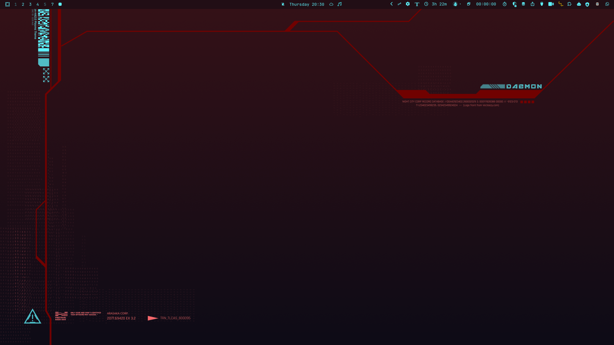
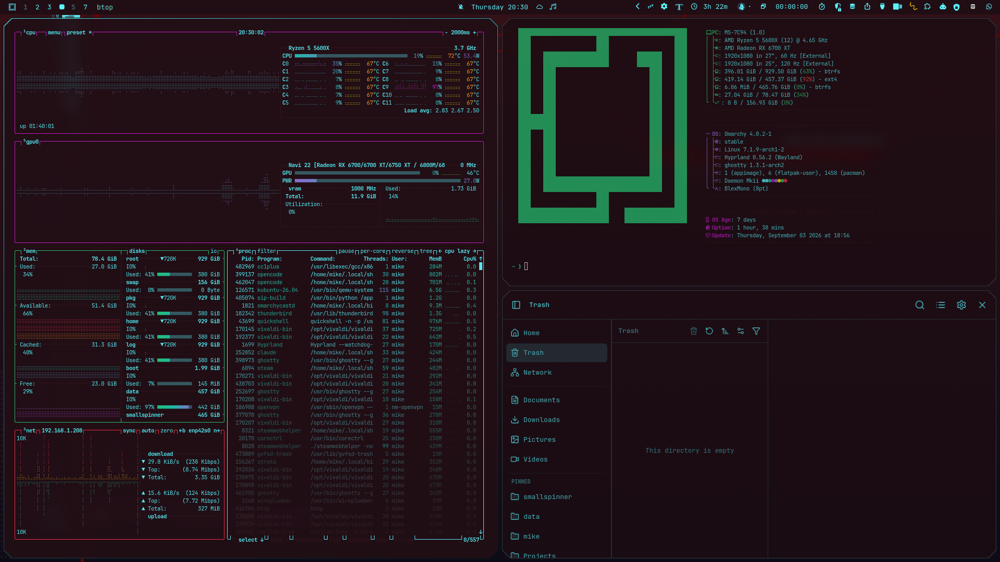

# Daemon MKII

A Cyberpunk 2077-inspired dark theme for [Omarchy](https://omarchy.org/), adapted from the [Daemon 2.0 KDE Plasma theme](https://github.com/MathisP75/daemon-kde-mk2) by MathisP75.




## Install

```
omarchy theme install https://github.com/doghouse-mike/omarchy-daemon-mkii-theme
```

## Color Palette

| Name             | Hex       |
|------------------|-----------|
| Accent           | `#5DF4FE` |
| Background       | `#210E15` |
| Dark Background  | `#14101F` |
| Red              | `#FB3048` |
| Green            | `#28C775` |
| Yellow           | `#FDF500` |
| Blue             | `#9370DB` |
| Magenta          | `#CB1DCD` |
| Cyan             | `#1AC5B0` |

## Credits

This theme is adapted from the **Daemon 2.0** global theme for KDE Plasma 6, created by [MathisP75](https://github.com/MathisP75).

- Original repository: [MathisP75/daemon-kde-mk2](https://github.com/MathisP75/daemon-kde-mk2)
- License: [GPL-3.0](LICENSE)

The color palette, wallpapers, and overall aesthetic are derived from the Daemon KDE theme. The Omarchy-specific configuration files (`colors.toml`, `hyprland.lua`) were written to translate the original KDE color scheme into Omarchy's theming system.

## License

[GPL-3.0](LICENSE) — same as the original Daemon KDE theme.
